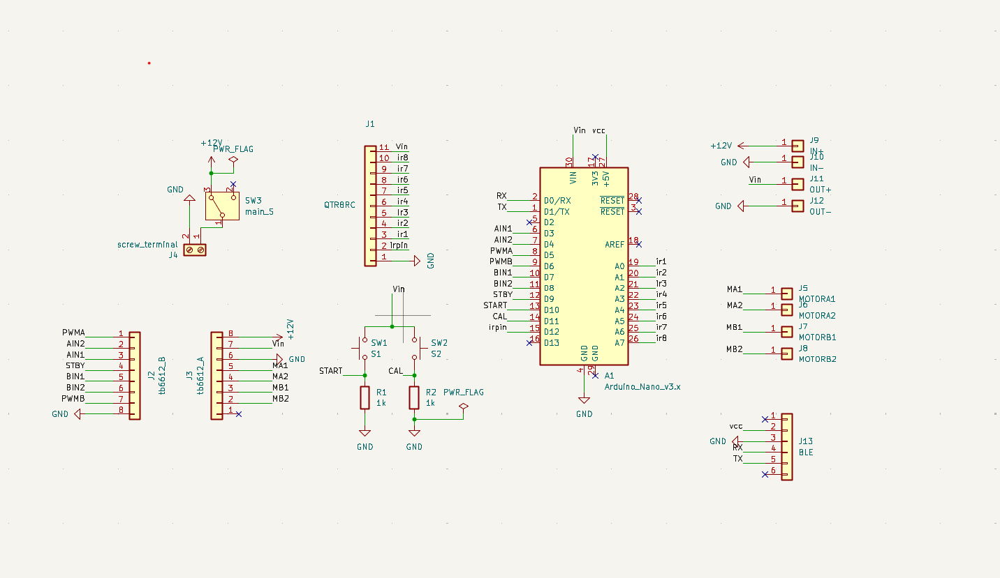
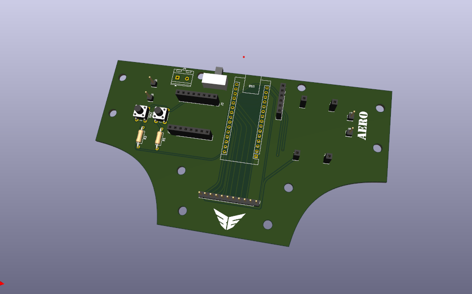

# AERO_linefollower

**AERO** is an autonomous line follower bot designed to detect and follow a path using IR sensors and motor control logic. It features an open-source hardware design with schematics and PCB layout, making it ideal for learning robotics, embedded systems, and circuit design.

## 🚀 Features

- Follows black or white lines using IR sensor array
- PWM motor control via TB6612 driver
- Custom PCB design 
- Fully open-source hardware and firmware
- Modular and compact design

---

## 🧠 Tech Stack

- **Microcontroller:** Arduino  Nano / 
- **Programming:** Arduino IDE (C++)
- **PCB Design:** KiCad 

---

## 🔩 Hardware Components

| Component              | Quantity | Description                          |
|------------------------|----------|--------------------------------------|
| Arduino Nano/          | 1        | Microcontroller board                |
| QTR8RC                 | 1        | 8 channel IR array                   |
| TB6612FNG Motor Driver | 1        | Dual H-bridge for DC motors          |
| N20 Motors + Wheels    | 2        | Robot locomotion                     |
| 12V Li-Po              | 1        | Li-polymer battery                   |
| Custom PCB             | 1        | Hand Soldered                        |
| Chassis                | 1        | 3-D printed                          |

---
## 🖼️ Schematic & PCB Design

### 🧾 PCB Layout

